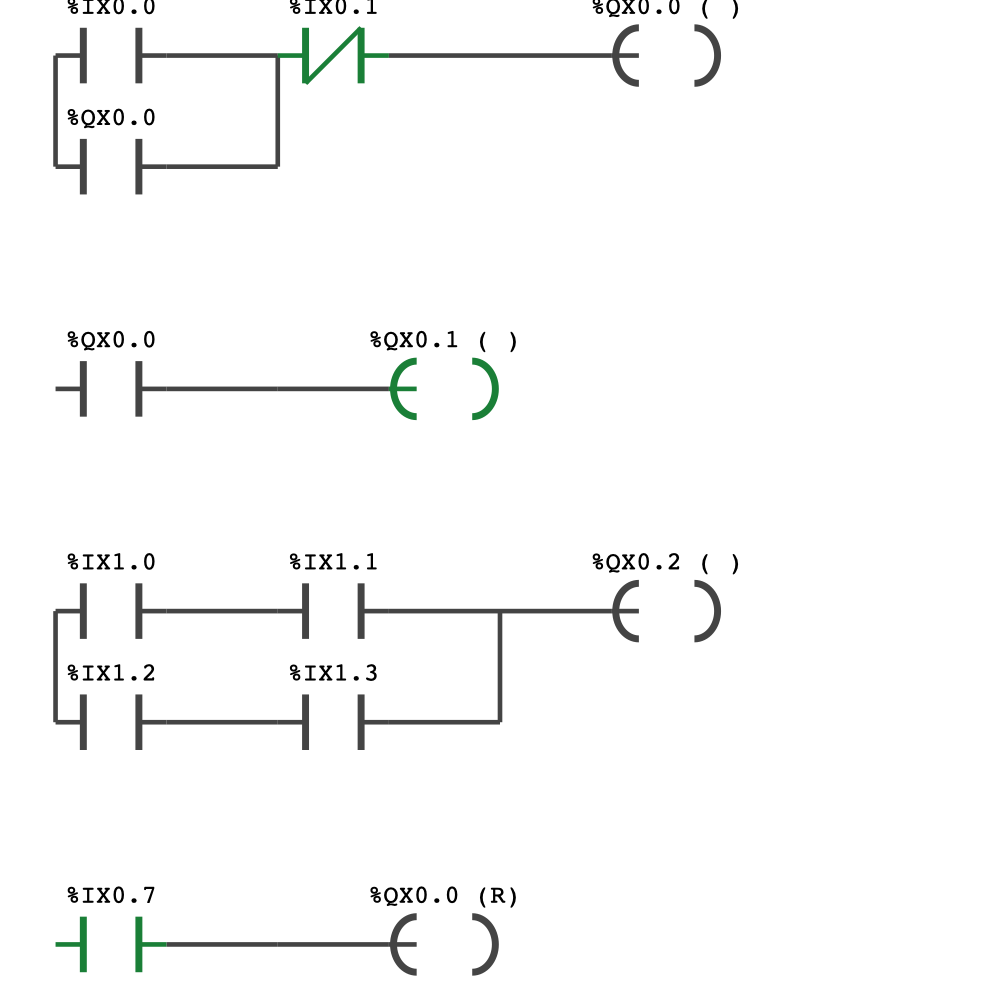
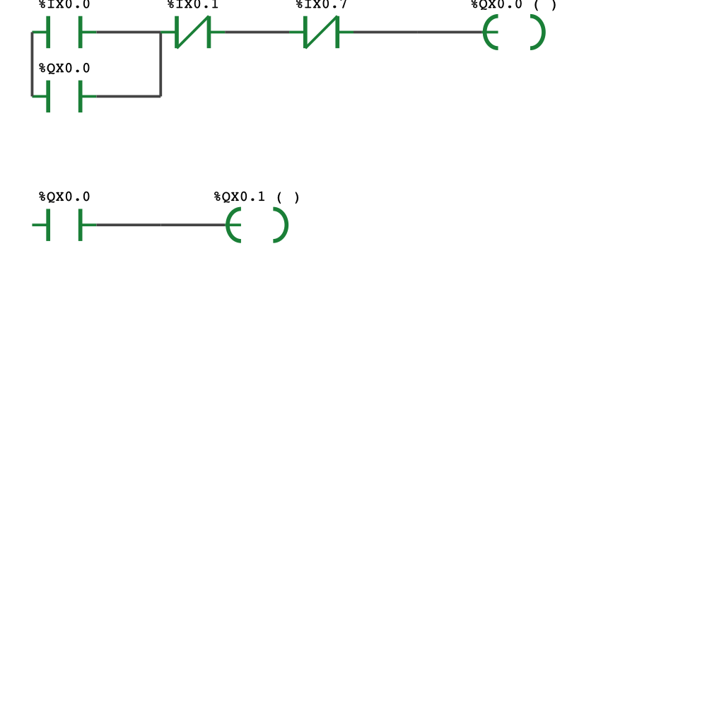
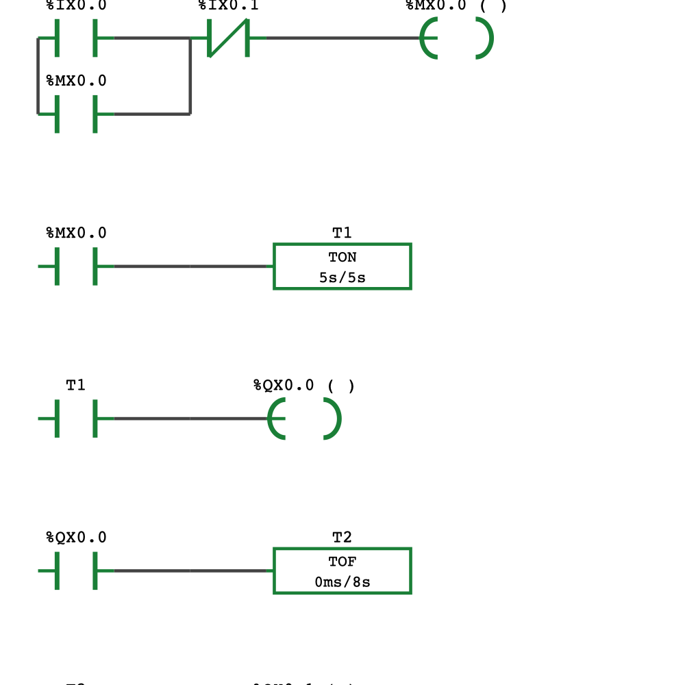
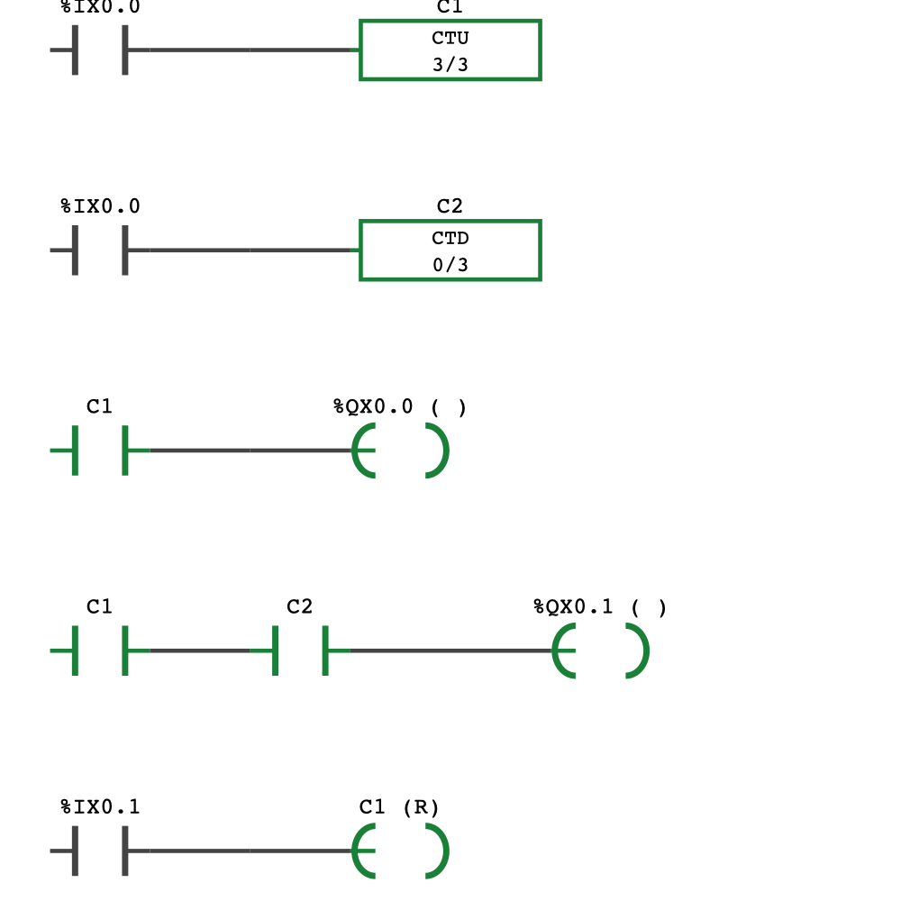

# Learning Common Lisp
Using AI to learn Common Lisp with a topic I am real familiar with PLC Programming.
This is very basic at the moment. Converts IL to LD and allows toggling Inputs by clicking on addresses. Then simulates a single scan. Pretty impressive for a first past.
# plc-sim

A scaffold for an **IEC 61131-3 simulator in Common Lisp** that parses
Instruction List (IL), converts it to a Ladder Diagram (LD), renders the
ladder graphically, and simulates inputs/outputs over a scan cycle.

The design rationale lives in
[`../qwen3.6-with-claude-suggestions.md`](../qwen3.6-with-claude-suggestions.md).
The one-line version: **IL is a 1-D stack machine, LD is a 2-D planar graph.**
Conversion means recovering the boolean *expression tree* the stack program
encodes. That tree is the single intermediate representation — the parser builds
it, the evaluator walks it, the layout engine renders it, and the pretty-printer
turns it back into IL.

```
IL text ──parse──▶ Expression Tree (IR) ──┬──evaluate──▶ Simulation state
                                          ├──layout─────▶ LD geometry ──▶ SVG / McCLIM
                                          └──print──────▶ IL  (round-trip validation)
```

## Layout

```
plc-sim.asd            Core system — zero external dependencies
plc-sim-clim.asd       McCLIM front-end (depends on the core)
verify.lisp            Dependency-free smoke test (sbcl --script verify.lisp)
make-docs.lisp         Regenerates docs/ ladder images (sbcl --script make-docs.lisp)
src/
  package.lisp         Package + exports
  ir.lisp              Expression-tree IR + smart constructors (series/parallel)
  parser.lisp          IL tokenizer, the stack-machine fold, IL pretty-printer
  eval.lisp            Memory model, evaluator, scan cycle, sim object
  layout.lisp          Two-pass ladder layout -> backend-agnostic primitives
  svg.lisp             Renders primitives to SVG (lets you SEE output, no GUI)
  clim-ui.lisp         McCLIM viewer: clickable contacts, live I/O panel
tests/
  tests.lisp           FiveAM suite
examples/
  motor-seal-in.il     Seal-in latch, indicator, parenthesized branch, fault RESET coil
  motor-interlock.il   Same logic with the fault folded in as a series interlock
  pump-on-delay.il     Timers: TON delayed pump start + TOF cooling-fan run-on
  batch-counter.il     Counters: CTU part counter + CTD remaining-capacity, batch reset
  stamp-press.il       One-shot: TP fires a fixed 2 s stamp pulse on a part's rising edge
docs/                  Rendered ladder images for the README (regen: make-docs.lisp)
```

### The two motor examples (seal-in vs interlock)

`motor-seal-in.il` clears `Run` with a separate `RESET` coil in a *later* rung,
while the indicator-lamp rung copies `Run` *earlier* in the same scan. So in a
single scan the lamp reads the old `Run` value before the fault resets it — the
lamp lags by one scan. A real PLC scans continuously and the lag is invisible;
here the GUI's **Toggle** command runs a *single* scan, so the display freezes
on exactly that impossible-looking state: toggle the fault on and `Run` reads
off while its lamp is still lit. That's deliberate — press **Scan** to advance
past the transient, or use **Step** (or `step-rung` at the REPL) to replay it
one rung at a time and see precisely where the lamp goes stale — see
"Single-stepping" below. (`plc-sim:stabilize` remains available at the REPL to
jump straight to the quiescent state a continuously-scanning PLC would reach.)

`motor-interlock.il` folds the fault into the seal-in rung as a normally-closed
series contact (`Run = (Start OR Run) AND NOT Stop AND NOT Fault`). `Run` then
already accounts for the fault, so every rung that reads it — including the lamp
— is consistent within a single scan, with no reset-coil lag.

Rendered with `render-svg-to-file` (green = energized):

| `motor-seal-in.il` — the one-scan transient | `motor-interlock.il` — energized |
|---|---|
|  |  |
| Fault asserted (`%IX0.7` green): rung 4's `(R)` coil drove `Run` (`%QX0.0`) **off** — its coil and contacts are gray — yet the `%QX0.1` lamp is still **green**, because rung 2 copied `Run` earlier in the same scan. An impossible-looking state, frozen by single-step scanning. | Fault folded in as the inline `%IX0.7` NC contact, so `Run` and its lamp drop together in one scan. The stale-lamp state is simply unreachable. |

For reference, the seal-in example in its normal energized steady state (Start
held, no fault) looks correct too —
[`docs/motor-seal-in-energized.png`](docs/motor-seal-in-energized.png) — the lag
only appears on the scan where the fault first asserts.

## Status

| Layer | State |
|-------|-------|
| IR, IL parser, fold, pretty-printer | ✅ implemented, tested |
| Memory model, evaluator, scan cycle | ✅ implemented, tested |
| Timers & counters (TON/TOF/TP, CTU/CTD) | ✅ implemented, tested (realtime ms; frozen virtual clock when stepping) |
| Threaded free-run mode (GUI Run/Stop) | ✅ implemented; scan thread follows the wall clock |
| Layout engine + SVG renderer | ✅ implemented, tested |
| Round-trip (IL → tree → IL → tree) | ✅ fixed-point verified |
| McCLIM GUI | ✅ compiles & loads against McCLIM; a live window needs a display (XQuartz) |

**135/135 FiveAM checks pass; the `verify.lisp` smoke test passes; `plc-sim-clim`
compiles and loads against McCLIM.** The GUI window itself was not *displayed*
here because this machine has no X11 backend (XQuartz not installed, `DISPLAY`
unset) — see "Launch the McCLIM GUI" below.

### The McCLIM / cl-ppcre dist bug (and the fix)

McCLIM would not load out of the box: Quicklisp dist `2026-01-01` ships
`cl-ppcre-20250622`, which **dropped the symbol
`CL-PPCRE:*STANDARD-OPTIMIZE-SETTINGS*`**, but `cl-unicode` (pulled in by McCLIM
via CLX) still does `(:import-from :cl-ppcre :*standard-optimize-settings*)`. A
bare `(ql:quickload "mcclim")` therefore aborts with
*"no symbol named \*STANDARD-OPTIMIZE-SETTINGS\* in CL-PPCRE"*. This is an
upstream packaging bug, independent of this project.

`load-clim.lisp` works around it by re-creating that symbol in the `cl-ppcre`
package before `cl-unicode` compiles. Remove the shim once upstream is back in
sync.

> Environment changes made while fixing this: Ultralisp's dist *preference* was
> lowered (so Quicklisp's consistent versions win for shared systems), and the
> stale Ultralisp `cl-unicode` release was uninstalled. To restore Ultralisp's
> precedence: `(setf (ql-dist:preference (ql-dist:dist "ultralisp")) 0)`.

## Quick start

### Core only (no Quicklisp needed)

```sh
cd plc-sim
sbcl --script verify.lisp        # loads src/ in order, asserts behaviour
```

### Via ASDF / Quicklisp

```lisp
(push (truename "/Users/brooksg44/common-lisp/plc-planning/plc-sim/")
      asdf:*central-registry*)
(ql:quickload "plc-sim")

;; Parse IL into the expression-tree IR:
(plc-sim:parse-il-string "LD A
AND B
OR C
ST Q")
;; => ((:COIL :NORMAL "Q"
;;      (:OR (:AND (:CONTACT :NO "A") (:CONTACT :NO "B")) (:CONTACT :NO "C"))))

;; Simulate:
(let ((sim (plc-sim:make-sim)))
  (plc-sim:load-il sim #p"examples/motor-seal-in.il")
  (setf (plc-sim:mem-bit (plc-sim:sim-memory sim) "IX0.0") t)  ; press Start
  (plc-sim:step-scan sim)
  (plc-sim:mem-bit (plc-sim:sim-memory sim) "QX0.0"))          ; => T (Run latched)

;; Render a ladder to SVG (open it in a browser):
(plc-sim:render-svg-to-file
  (plc-sim:parse-il #p"examples/motor-seal-in.il")
  #p"/tmp/ladder.svg")
```

### Run the tests

```lisp
(ql:quickload "fiveam")
(asdf:test-system "plc-sim")
```

### Launch the McCLIM GUI

McCLIM's default backend is CLX (X11). On macOS install **XQuartz**
(`brew install --cask xquartz`), start it (`open -a XQuartz`), then:

```sh
cd plc-sim
DISPLAY=:0 sbcl --load load-clim.lisp
```

> **Note (macOS):** XQuartz sets `$DISPLAY` to a launchd socket path like
> `/var/run/com.apple.launchd.XXXX/org.xquartz:0`, which CLX can't parse — it
> tries to resolve the whole path as a hostname and fails with
> `SB-BSD-SOCKETS:HOST-NOT-FOUND-ERROR` ("Name service error in
> \"getaddrinfo\""). Override it with `DISPLAY=:0`, which connects via the
> standard Unix socket `/tmp/.X11-unix/X0` that XQuartz also listens on.
```lisp
(plc-sim-clim:run :il #p"examples/motor-seal-in.il")
;; Click a contact's label or an I/O row to toggle it; the energized
;; path recolours after each scan. Type "Run" / "Stop" / "Scan" /
;; "Step" / "Toggle" / "Load" / "Quit" in the interactor pane.
```

**Free run:** `Run` scans continuously in a background thread, with timers
following the **wall clock** (a `T#5s` TON completes five real seconds after
its rung goes true, regardless of scan rate). `Toggle` works while running —
the next scan picks the bit up. `Stop` pauses; so does typing `Scan` or
`Step`, which take over on the frozen virtual clock (below). The I/O panel
header shows `RUN`/`STOP`, the scan count, and the sim clock.

**Single-stepping:** `Scan` runs one full scan cycle; `Step` executes a *single
rung*. While paused the clock is **frozen virtual time**: each `Scan` advances
it by the sim's scan period (default 1 s — so stepping a timer is deterministic,
never a race against the wall clock; tune with
`(setf (plc-sim:sim-scan-period-ms sim) …)`). The arrowhead at the left rail
points at the rung that will execute next — solid orange while a scan is
mid-flight, hollow gray at a scan boundary — and the I/O panel shows
`scan N (next rung i/m)`. While mid-scan, `Toggle` only flips the bit (no scan
runs), so you can watch the new input propagate rung by rung; `Scan` finishes
the remainder of the stepped cycle.

`load-clim.lisp` applies the cl-ppcre shim (above), loads McCLIM and
`plc-sim-clim`, and prints the launch line. Without a display you'll get a
"can't open display" error from CLX — that's the missing XQuartz, not the code.

## IL dialect supported

Both Siemens STL and IEC textual mnemonics are accepted:

| Operation | Spellings |
|-----------|-----------|
| Load          | `LD`, `L` |
| Load negated  | `LDN`, `LN` |
| And / And-not | `AND` / `ANDN`, `A` / `AN`, also `AND NOT` |
| Or / Or-not   | `OR` / `ORN`, `O` / `ON`, also `OR NOT` |
| Open block    | `AND(` / `OR(`, `A(` / `O(` (operand may ride along) |
| Close block   | `)` |
| Store         | `ST`, `=`, `:=` |
| Set / Reset   | `S` / `R`, `SET` / `RESET` |
| Timers        | `TON` (on-delay), `TOF` (off-delay), `TP` (pulse) — `TON T1, T#5s` (TIME literal, or a bare integer = milliseconds) |
| Counters      | `CTU` (count up), `CTD` (count down) — `CTU C1, 3` |

Comments: `//…` and `;…` to end of line. Networks split on `NETWORK` markers or
`label:` lines (and each store ends a rung).

### Timers and counters

A timer or counter terminates a rung like a coil and takes an instance name
plus a preset (the comma is optional). Timer presets are **IEC TIME literals**
— `TON T1, T#5s`, also `T#500ms`, `T#1m30s`, `T#1.5s` (underscores allowed,
`TIME#` works too); a bare integer means milliseconds. Counter presets are
plain integer counts. The instance's *done bit* lives under its name, so plain
contacts read it back: `LD T1`, `AND C1`, etc.

**The time base is real milliseconds of sim time.** The clock is sampled once
per scan — every rung in a scan sees the same timestamp, like a real PLC — and
where the time comes from depends on the mode:

- **Free run** (GUI `Run`, or `plc-sim:sim-start-realtime` at the REPL): each
  scan samples the wall clock, so a `T#5s` TON completes after five real
  seconds whatever the scan rate.
- **Paused / stepping** (the default): the clock is frozen *virtual* time;
  each manual `Scan` advances it by the sim's scan period — **default 1000 ms,
  so one `Scan` press = one second** (`(setf (plc-sim:sim-scan-period-ms sim)
  100)` for finer steps). Single-stepping a timer is therefore deterministic,
  not a race against the wall clock.

| Instruction | Behaviour |
|-------------|-----------|
| `TON T1, T#5s` | Done once the rung has been true for 5 s of sim time; false rung resets it |
| `TOF T1, T#5s` | Done while the rung is true; after it goes false, holds until 5 s have elapsed (Q drops on the scan where ET reaches the preset, mirroring TON) |
| `TP T1, T#5s`  | A rising edge fires the done bit for 5 s (not retriggerable) |
| `CTU C1, n` | Counts rising edges of the rung; done once the count reaches `n` |
| `CTD C1, n` | Loads `n`, counts rising edges *down*; done at zero |

A `RESET` coil clears an instance: `R C1` zeroes a `CTU` (or timer) and
*reloads* a `CTD` to its preset. Note that `STABILIZE` (run-to-quiescence,
available at the REPL) compares only bits between scans, deliberately: it will
not fast-forward a running timer to its preset — step `Scan` (or free-run) to
advance time.

Both example programs rendered mid-story (green = energized; boxes show
`elapsed/preset`):

| `pump-on-delay.il` — TON elapsed, pump + fan on | `batch-counter.il` — batch of 3 complete |
|---|---|
|  |  |
| Start latched `%MX0.0`; `T1` reads 5s/5s so the pump runs, and the `TOF` follows the pump, holding the fan. Press Stop and keep going: the pump drops at once, the fan runs 8 more seconds. | Three sensor pulses counted: the `CTU` reads 3/3 (done) while the mirror-image `CTD` reads 0/3 (done). The reset button clears `C1` to 0 and reloads `C2` to 3. |

## Limitations & next steps (in priority order)

1. ~~**Timers / counters** (`TON`, `TOF`, `TP`, `CTU`, `CTD`)~~ — **done**; see
   "Timers and counters" above. The time base is real milliseconds, wall-clock
   in free-run mode (item 6) and frozen virtual time when stepping.
2. **Function blocks & non-boolean ops** (`L`/`T`, `ADD`, `CAL`, `JMP`) — the IR
   reserves a `(:fb …)` node and the layout/SVG already draw a box for it; the
   evaluator currently errors on `:fb` (intentional TODO).
3. **Real addressing** — memory is a name→value hash table, which is accurate
   enough for boolean ladder. Swap in bit/byte arrays with offset arithmetic
   (`%MW10`, `%DB1.DBD4`) when you need word/overlapping addressing.
4. **Layout polish** — the two-pass engine handles series/parallel/nesting but
   does not yet vertically centre uneven `OR` branches or de-duplicate shared
   rails. Good enough to read; refine before shipping.
5. **Compile-verify and flesh out `clim-ui.lisp`** once McCLIM loads.
6. ~~**Threaded run mode**~~ — **done**; the GUI's `Run` command starts a
   `bordeaux-threads` ticker that queues tick *events* onto the frame's event
   queue (so all sim mutation stays in the frame's own process, and the
   interactor prompt is left alone), with timers following the wall clock.
   `Stop`/`Scan`/`Step` pause it.
```
